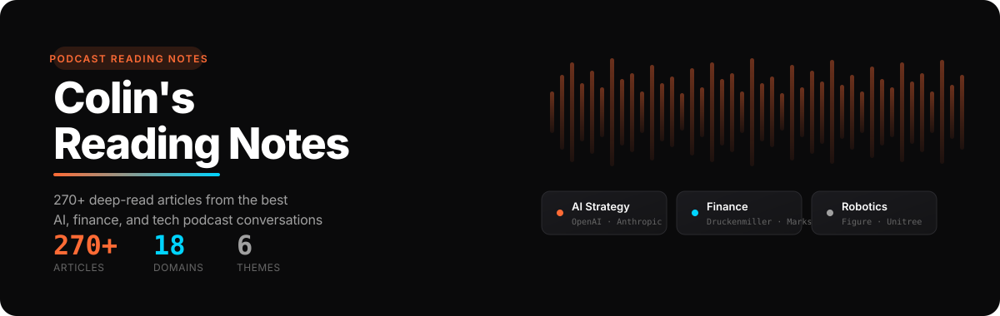

<p align="center">
  
</p>

<p align="center">
  <a href="https://canqihe.github.io/yt-podcast/">Live Demo</a> · <a href="#quick-start">Quick Start</a> · <a href="#topics-covered">Browse Topics</a>
</p>

---

<p align="center">
  
</p>

A curated knowledge platform that distills the best YouTube podcast conversations into structured, in-depth articles. Each article is a carefully crafted synthesis of expert conversations — no fluff, just the insights that matter.

**270+ articles** across **18 domains**: AI strategy, semiconductor supply chains, robotics, global macro, defense tech, and more. Every piece reorganizes long-form conversations into scannable, evidence-backed reads.

Browse all articles at **[index.html](index.html)** or visit the **[GitHub Pages](https://canqihe.github.io/yt-podcast/)** deployment.

---

<p align="center">
  
</p>

| Domain | Featured Sources |
|--------|-----------------|
| **AI Strategy & Leaders** | OpenAI (Sam Altman, Greg Brockman), Anthropic (Dario Amodei, Mike Krieger), Google DeepMind (Demis Hassabis), NVIDIA (Jensen Huang), xAI (Elon Musk) |
| **AI Agents & Platforms** | Harrison Chase (LangChain), Andrej Karpathy, Claude Code, Harvey AI, Stripe (Emily Sands) |
| **Markets & Compute** | a16z, Coatue, SemiAnalysis (Dylan Patel), ARK Invest, Gavin Baker |
| **Semiconductors** | Cerebras (Andrew Feldman), TSMC, NVIDIA TPU, Micron, Stanford CS153 |
| **Robotics & Physical AI** | Figure AI (Brett Adcock), Unitree, Anduril, Palantir (Alex Karp) |
| **Finance & Investing** | Stanley Druckenmiller, Howard Marks, Ken Griffin, Paul Tudor Jones, Jim Simons |
| **Space & Frontier Tech** | SpaceX, NASA (Jared Isaacman), Rocket Lab (Peter Beck), Quantum Computing |
| **Philosophy & Society** | Yuval Harari, Kevin Kelly, Dan Shipper, Swami Sarvapriyananda |
| **Health & Science** | David Sinclair, Ben Lamm, synthetic biology, AI-designed life forms |
| **Crypto & Web3** | Worldcoin (Alex Blania), Circle (Jeremy Allaire), stablecoins, agent economy |

<details>
<summary><strong>View all 18 domains</strong></summary>

| Domain | Examples |
|--------|----------|
| AI Strategy & Leaders | OpenAI, Anthropic, Google AI, NVIDIA, xAI |
| AI Agents & Platforms | LangChain, Karpathy, Claude Code, Harvey AI |
| AI Engineering & Research | Shane Legg, Joelle Pineau, Richard Sutton |
| AI Safety & Ethics | Tristan Harris, Carissa Véliz, AGI Safety |
| Markets & Compute | a16z, Coatue, SemiAnalysis, ARK Invest |
| Semiconductors | Cerebras, TSMC, NVIDIA, Micron |
| Robotics & Physical AI | Figure AI, Unitree, Anduril, Palantir |
| Finance & Investing | Druckenmiller, Marks, Griffin, Simons |
| Defense & Military | Palantir, Anduril, Pentagon AI |
| Space & Frontier Tech | SpaceX, NASA, Rocket Lab, Quantum |
| Tech Companies & Earnings | Alphabet, Tesla, Roblox, Shopify |
| Philosophy & Society | Harari, Kelly, Shipper |
| Wisdom & Thinking | Kevin Kelly, Ben Horowitz, Joe Hudson |
| Health & Science | Sinclair, Lamm, synthetic biology |
| Crypto & Web3 | Worldcoin, Circle, stablecoins |
| Organizational Transformation | Jack Dorsey, Replit, agent-led growth |
| Energy & Infrastructure | Data center energy, global infrastructure |
| Global Trade & Geopolitics | Ryan Petersen, trade policy |

</details>

---

## Quick Start

```bash
git clone git@github.com:canqihe/yt-podcast.git
cd yt-podcast
open index.html
```

Or visit the **[GitHub Pages](https://canqihe.github.io/yt-podcast/)** deployment — no install needed.

---

<p align="center">
  
</p>

**6 curated color schemes** with dark/light mode — all gradients, glows, and accents auto-inherit from CSS custom properties:

| # | Scheme | Primary | Secondary |
|---|--------|---------|-----------|
| 1 | Orange-Cyan | `#ff6b35` | `#00d4ff` |
| 2 | Purple-Yellow | `#a855f7` | `#FFC107` |
| 3 | Green-Yellow | `#22c55e` | `#eab308` |
| 4 | Blue-Indigo | `#3b82f6` | `#818cf8` |
| 5 | Coral-Gold | `#f97066` | `#fbbf24` |
| 6 | Teal-Violet | `#14b8a6` | `#a78bfa` |

See `design-system/design-tokens.css` for the full token system.

---

## Tech Stack

- **HTML5 / CSS3 / Vanilla JS** — zero dependencies, no build step
- **CSS Custom Properties** — design tokens for consistent theming
- **Intersection Observer** — scroll-triggered animations
- **Google Fonts** — Fraunces, Source Serif 4, Space Mono, Orbitron, JetBrains Mono

## Project Structure

```
yt-podcast/
├── index.html                  # Homepage (article grid)
├── articles/                   # 270+ in-depth articles
│   ├── images/                 # Article hero images
│   └── research/               # Equity research reports
├── assets/
│   ├── css/                    # Stylesheets
│   ├── js/                     # Modular JS components
│   └── images/                 # Shared images
├── design-system/
│   ├── design-tokens.css       # Design tokens & color schemes
│   ├── article-styles.css      # Article-specific styles
│   └── template-standalone.html# Standalone article template
├── rss-feeds.html              # RSS feed reader
└── rss-reader.html             # RSS reader UI
```

## Interactive Features

- **Search** — real-time filtering by title, description, category, or tags
- **Theme Switcher** — toggle between light and dark modes
- **Pagination** — browse articles 15 per page
- **External Links** — [Indigo Reading List](articles/indigo_readlist.html), [RSS Feeds](rss-feeds.html)

---

## Contributing

Issues and pull requests are welcome.

## License

Content is curated from YouTube podcasts for educational purposes. Original content belongs to respective creators.

## Maintainer

[canqihe](https://github.com/canqihe) · [X/Twitter](https://x.com/nfa_trader)
